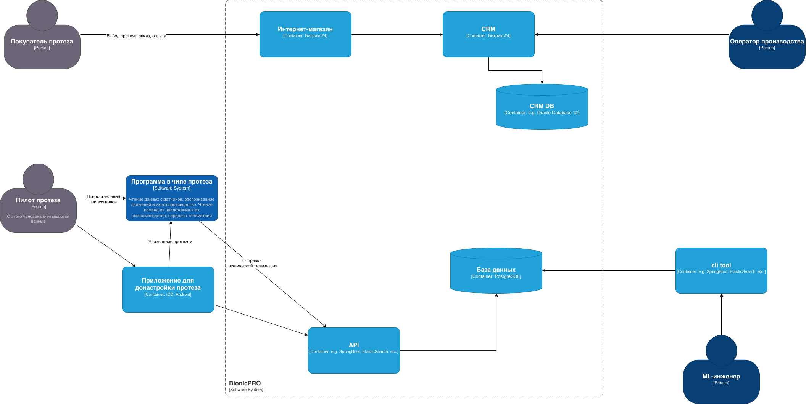

- [1. Сдача проектной работы 9 спринта](#1-сдача-проектной-работы-9-спринта)
  - [1.1. Как работают протезы](#11-как-работают-протезы)
  - [1.2. Как изготавливают протез](#12-как-изготавливают-протез)
  - [1.3. Как донастраивать протез](#13-как-донастраивать-протез)
  - [1.4. О компании](#14-о-компании)
  - [1.5. Проблемы и бизнес-задачи компании](#15-проблемы-и-бизнес-задачи-компании)
  - [1.6. Цели бизнеса](#16-цели-бизнеса)
- [Задания](#задания)
  - [Задание 1. Повышение безопасности системы](#задание-1-повышение-безопасности-системы)
  - [Задание 2. Разработка сервиса отчётов](#задание-2-разработка-сервиса-отчётов)
  - [Задание 3. Снижение нагрузки на базу данных](#задание-3-снижение-нагрузки-на-базу-данных)
  - [Задание 4. Повышение оперативности и стабильности работы CRM](#задание-4-повышение-оперативности-и-стабильности-работы-crm)

# 1. Сдача проектной работы 9 спринта
В этом спринте будете работать над кейсом BionicPRO — российской компании, которая производит и продаёт бионические протезы.
Чтобы вам было проще разобраться с архитектурными задачами, сперва необходимо рассказать про особенности производства и эксплуатации протезов. Именно они сформировали основные вызовы для команды разработки.

## 1.1. Как работают протезы
1. Каждый бионический протез состоит из шести компонентов.
Миодатчики. Они считывают миосигналы с мышц, которые остались выше культи. Миосигналы — это биоэлектрические сигналы, которые возникают в результате электрической активности мышц.
2. Чип типа ESP32. Он считывает данные с миодатчиков. В чипе установлена программа на C++. Она анализирует миосигналы и по ним определяет, какое действие необходимо совершить. Затем она посылает сигнал актуаторам.
3. Актуаторы. Исполнительные устройства, которые преобразуют электрическую энергию в механическую. Они позволяют протезу выполнять движения, которые соответствуют командам пользователя.
4. Батарея. Источник питания, который обеспечивает энергией все компоненты протеза.
5. Система управления батареей. Она контролирует заряд и разряд батареи, а также предотвращает её перегрев и перегрузку.
6. Корпус. Это оболочка протеза, которая защищает его компоненты от внешнего воздействия.
## 1.2. Как изготавливают протез
1. Пациент заказывает у компании протез и оплачивает его.
2. После оплаты пациент приходит на первичный замер, чтобы сделать слепки ампутированной конечности. По слепкам делают культеприёмник, который вставляют в протез.
3. Протез изготавливают от одного до двух месяцев. В это время пациент должен периодически посещать офис компании для примерки.
4. Когда протез готов, пациент приходит на финальную примерку.
5. Если во время финальной примерки новые доработки не были запланированы, стартует серия обучений для пользователя. В это время команда записывает индивидуальные миосигналы пациента на протез.

Одно из важнейших свойств протеза — это скорость реагирования. Желательно, чтобы она не превышала 100 миллисекунд. В противном случае протезом будет сложно пользоваться.

Обеспечить высокую скорость реагирования непросто. Миодатчики сами по себе производят много шума в данных. Это происходит из-за того, что миосигналы достаточно слабые. Их могут искажать электромагнитные помехи от электронных устройств, механические вибрации и даже нестабильная работа батареи.

При этом миосигналы каждого человека уникальны. К тому же со временем они могут меняться. Иногда это происходит уже через месяц после первичной настройки. 

Чтобы повысить скорость реагирования, программу распознавания движения помещают на сам протез — в чип. А чтобы она правильно интерпретировала сигналы мышц, её периодически приходится донастраивать.

## 1.3. Как донастраивать протез
Для этого в BionicPRO разработали приложения на Android и iOS. Они позволяют пилоту протеза самостоятельно донастраивать протез в процессе эксплуатации.

Компании важно, чтобы алгоритмы распознавания движения работали как можно быстрее.Чтобы улучшить свою ML-модель, BionicPRO собирает и хранит информацию о сигналах и движениях протеза по всем своим пользователям. Чип отправляет данные через 4G-модуль.

Изначально компания получала данные с протезов раз в день. Но недавно она переключилась на сбор данных в режиме реального времени. По необходимости пользователи могут отключить эту функцию.

## 1.4. О компании
В компании пять отделов:
- отдел продаж,
- отдел производства и эксплуатации,
- отдел маркетинга,
- отдел машинного обучения (ML),
- отдел разработки.
В IT-системе BionicPRO четыре ключевых компонента:
- Программа в чипе протеза.
- Приложение для донастройки протеза.
- Интернет-магазин.
- CRM.
Диаграмма контейнеров BionicPRO в модели C4:

## 1.5. Проблемы и бизнес-задачи компании
В последнем уроке первой темы мы реализовали SSO через Oauth2.0 Code Grant в Keycloak. С тех пор компанию успели взломать. И это даже несмотря на то, что мы использовали Code Grant.

Хакеры воспользовались уязвимостью и скачали персональные данные пользователей по всем протезам. Ходит слух, что утечка дошла до конкурентов BionicPRO, и они уже знают, сколько активных пользователей есть у компании.

Когда информация о взломе достигла СМИ, клиенты BionicPRO подали в суд на компанию. Если не урегулировать конфликт в досудебном порядке, есть риск, что компании придётся заплатить большие штрафы.

Директор BionicPRO в срочном порядке созвал собрание руководителей. В ходе обсуждения команда решила, что самая приоритетная задача сейчас — это усилить безопасность. 

При решении проблемы важно не забывать о том, что пользователи узнали о сборе данных и теперь хотят получать больше информации о работе своих протезов. Они требуют, чтобы разработчики добавили в приложение возможность скачать отчёт о работе протеза. Чтобы урегулировать судебные иски, компания пошла на уступки и пообещала предоставить такую функцию для пользователей Android-приложения.

Ещё несколько важных проблем, с которыми столкнулась компания:
- Огромный объём данных. Изначально у компании была только одна база данных — PostgreSQL. Очень быстро она начала ухудшать показатели работы системы. Команда попробовала использовать индексы, но и это не помогло: слишком большое количество данных начало влиять на остальные таблицы базы.
- Выход на новые рынки и соблюдение требований законодательства. Компания сейчас работает только в России, но планирует осваивать новые рынки и развивать свои продукты в других странах. BionicPRO работает с медицинскими данными, и во многих странах есть требования к хранению такой информации. Нужно учитывать, что правовое регулирование в разных странах может отличаться. Важно продумать, как будут храниться данные о пациентах, в том числе — авторизационные.

## 1.6. Цели бизнеса
Компания BionicPRO ставит перед собой следующие цели:
- Злоумышленники не должны использовать уязвимость SSO в приложении.
- У пользователей должна быть возможность скачать данные о работе протеза в виде отчёта. Чтобы реализовать эту функциональность, необходимо выгружать данные из CRM в ClickHouse. Для этого требуется написать отдельное приложение, которое сможет предоставлять отчёт из нескольких источников — CRM и DB.
- Пользователь должен иметь доступ только к тем отчётам, которые содержат данные о его протезе или протезах. Доступ к информации о других пользователях должен быть закрыт.

# Задания

## [Задание 1. Повышение безопасности системы](Task1/README.md)

## [Задание 2. Разработка сервиса отчётов](Task2/README.md)

## [Задание 3. Снижение нагрузки на базу данных](Task3/README.md)

## [Задание 4. Повышение оперативности и стабильности работы CRM](Task4/README.md)