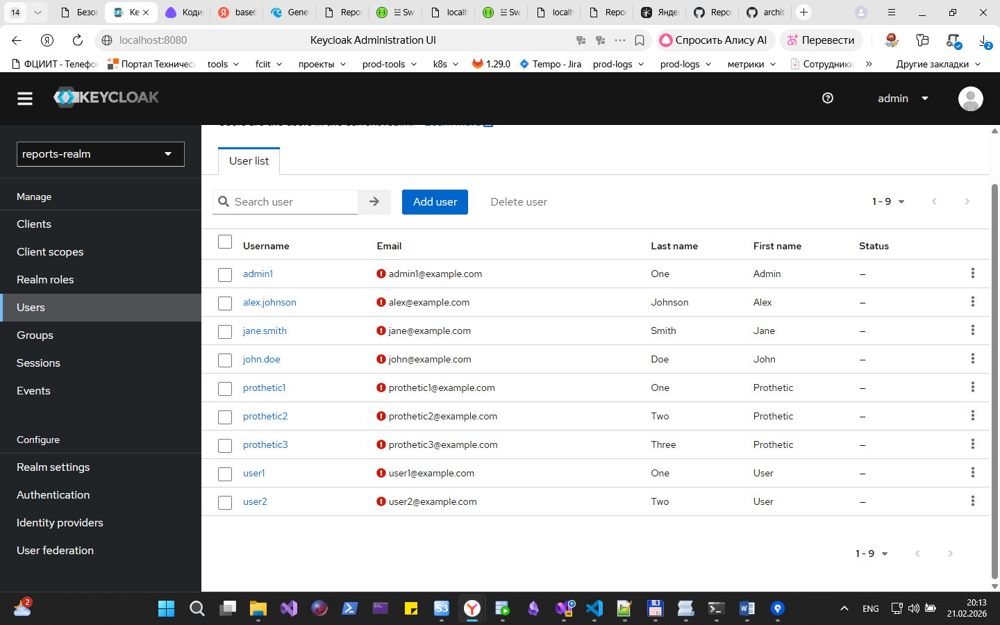
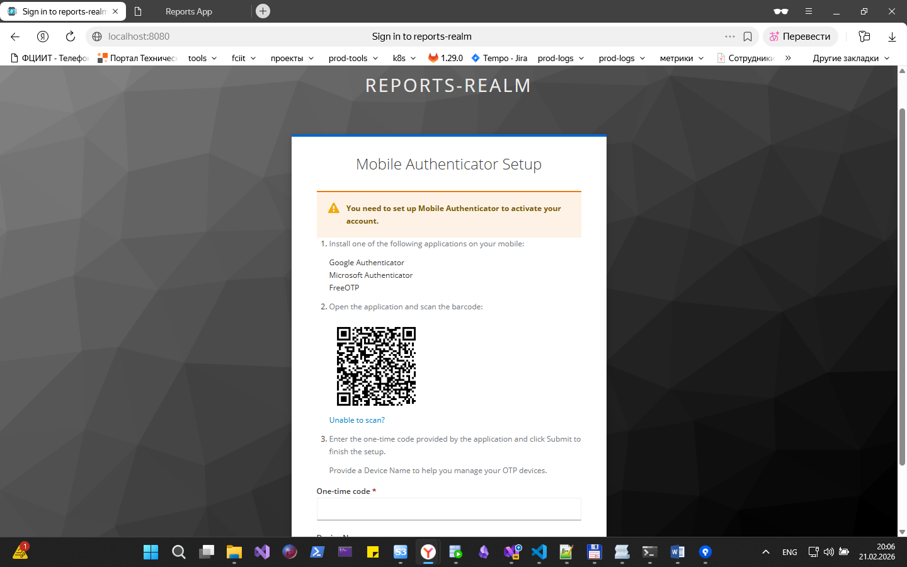
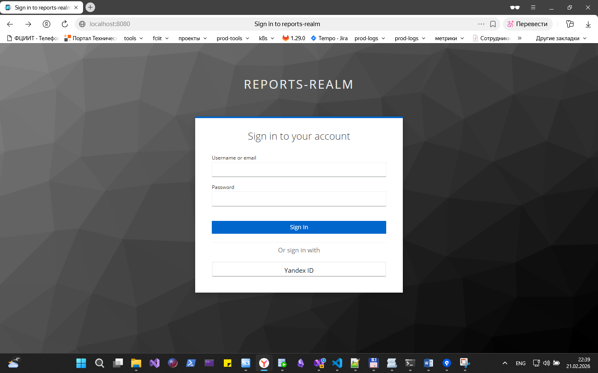

# Задача 1. Предложите архитектурное решение и доработайте диаграмму C4 для управления учётными данными пользователя. 

# Задача 2. Улучшите безопасность существующего приложения, заменив Code Grant на PKCE. 

# Задача 3. Обеспечьте безопасное получение и хранение access-и refresh-токенов.

Код в bionicpro-auth

# Задача 4. Добавьте LDAP для возможности получения данных о пользователях представительства BionicPRO в другой стране.

Пользователи и группы синхронизированы:

# Задача 5. Настройте MFA.
Экспортирован realm после всех манипуляций с Keycloak в файл [keycloak-results-export.json.json](../keycloak/keycloak-results-export.json.json).

# Задача 6. Добавьте OAuth 2.0 от Яндекс ID.

