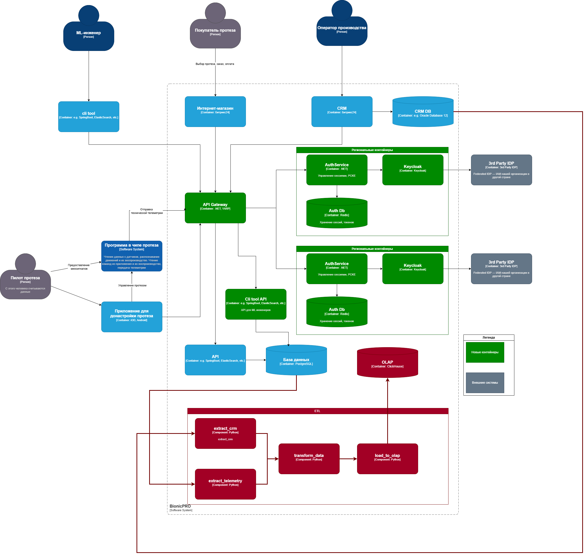
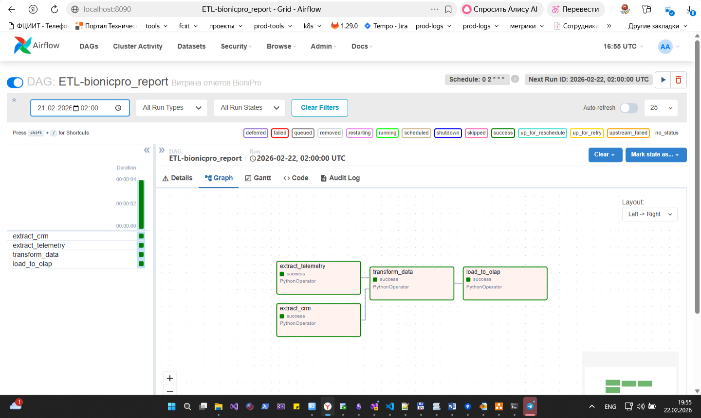

# Задача 1. Создать архитектуру решения для подготовки и получения отчётов.



# Задача 2. Разработать Airflow DAG и настроить его на запуск по расписанию.



- Реализация DAG: [dag.py](../airflow/dags/dag.py)
- x-airflow-common в docker-compose взять из учебника по спринту 
```s

[](./task2.png)